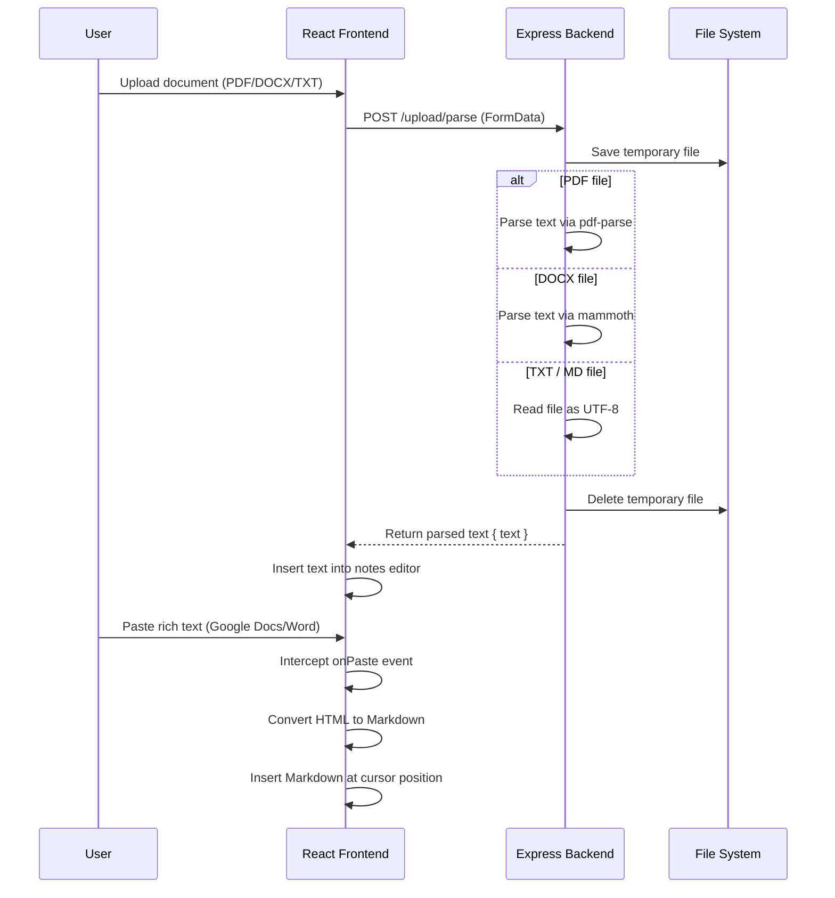

# Design Specification: Document Parsing and Rich Copy-Paste for Course Designer
**Date:** 2026-07-10
**Status:** Approved / Implementing

This specification outlines the integration of PDF, DOCX, and TXT/MD document support into the LMS Course Designer. It covers automatic rich paste conversion to Markdown, cleaning up PDF line wrap anomalies, and direct document upload parsing.

---

## 1. Objectives

- **Rich Formatting Preservation on Paste:** Automatically detect rich clipboard text (from Google Docs, Word, or web pages) and convert it into clean Markdown directly inside the notes editor.
- **Smart PDF Paste Cleanup:** Provide a way to clean up annoying mid-sentence line breaks introduced by copy-pasting from PDFs.
- **Document Upload & Parsing:** Support drag-and-drop or select-to-upload PDF, DOCX, and TXT files, parse their contents on the backend, and insert the result directly into the notes editor.

---

## 2. Architecture & Tech Stack

We adopt a **Hybrid Client-Server** model:
- **Frontend (Paste Interception):** Standard `<textarea>` paste event interception. It uses a lightweight DOM traversal function (native `DOMParser`) to serialize clipboard HTML into clean Markdown structure on-the-fly.
- **Backend (File Parsing):** 
  - Install `pdf-parse` to extract text from PDF files.
  - Install `mammoth` to extract text from DOCX files.
  - Plain text (`.txt` and `.md`) will be read directly.
  - A new `/upload/parse` endpoint handles temporary file uploads, runs the appropriate parser, deletes the temp file, and returns clean text.

---

## 3. Proposed Changes

### 3.1 Backend Changes

#### Dependencies
We need to add the following npm packages to the backend:
- `pdf-parse` (v1.1.1)
- `mammoth` (v1.8.0)

#### [MODIFY] [uploadRoutes.js](file:///c:/Users/UTKARSH/Downloads/NEETBANBV2/backend/src/routes/uploadRoutes.js)
Add a `/parse` POST endpoint that parses uploads:
- Accepts `file` field via Multer middleware.
- Validates file extensions (`.pdf`, `.docx`, `.txt`, `.md`).
- Executes extraction:
  - `.pdf` -> `pdfParse(dataBuffer)`
  - `.docx` -> `mammoth.extractRawText({ path: filePath })`
  - Others -> Read as UTF-8.
- Cleans up the temporary file from the disk.
- Returns `{ text: extractedText }`.

---

### 3.2 Frontend Changes

#### [MODIFY] [CourseDesigner.jsx](file:///c:/Users/UTKARSH/Downloads/NEETBANBV2/frontend/src/components/Admin/CourseDesigner.jsx)
We will enhance the notes editor UI and paste capabilities:
- **HTML to Markdown Converter:** Implement a native DOM-based HTML-to-Markdown parser.
- **Smart Paste Handler:** 
  - Intercept the `paste` event on the notes `<textarea>`.
  - Check if `text/html` is present in the clipboard data.
  - If so, parse it, convert to Markdown, and insert it at the cursor. If not, fallback to default browser paste.
  - Add a checkbox toggle `[x] Auto-format rich paste` above the editor.
- **Smart Line Break Cleanup:**
  - Add a button **"Clean PDF Wraps"** next to the notes editor.
  - When clicked, it splits the editor contents by paragraph (`\n\n`), replaces single newlines in paragraph blocks with spaces, and saves the cleaned text back to the editor.
- **Document Upload Input:**
  - Add an **"Upload Document"** button (with a paperclip / document upload icon).
  - Triggers a hidden file input supporting `.pdf`, `.docx`, `.txt`, `.md`.
  - While uploading/parsing, displays a loading spinner and disables the text area.
  - On success, appends the extracted text to the cursor position (or end of file).

---

## 4. Verification Plan

### Automated Tests
- We will write a lightweight scratch test script in the backend `scratch/test-parser.js` to ensure PDF and DOCX parsing works perfectly.

### Manual Verification
1. Open the Course Designer and edit a lesson of type "Notes".
2. Copy a styled document from Google Docs or Microsoft Word (with headers, bold text, and bullet lists). Paste it into the editor. Verify that it gets converted to clean Markdown.
3. Copy text from a PDF document (which has line-breaks at the end of each line). Paste it into the editor, select it (or check the whole content), and click "Clean PDF Wraps". Verify that sentences are joined properly and double-newlines are preserved.
4. Click the "Upload Document" button, select a test `.docx` file and a test `.pdf` file. Verify that the text contents are successfully extracted and populated in the editor.
